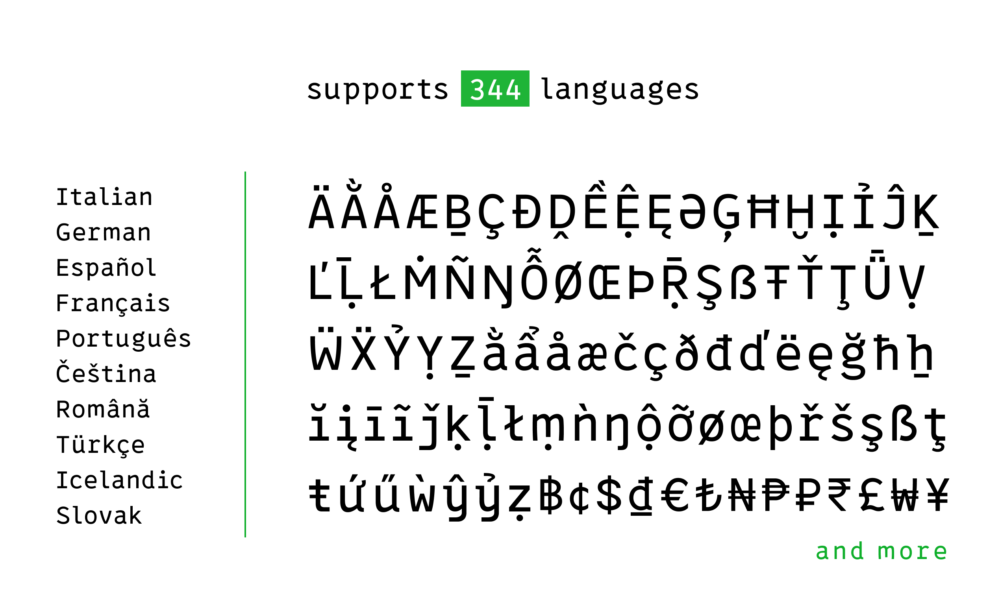
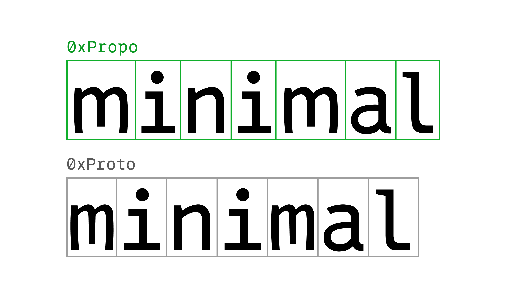
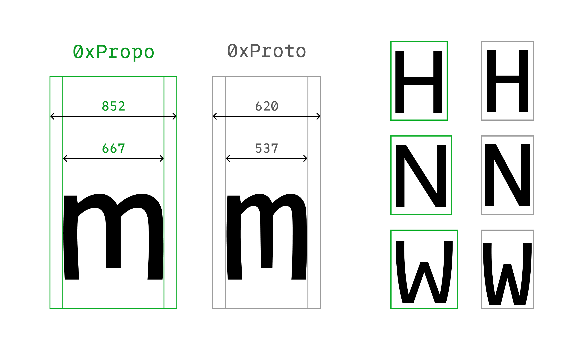

# 0xPropo

Just the proportional version of [0xProto](https://github.com/0xType/0xProto).

## NOTICE

- **Not for coding**: If you’re a software engineer looking for a monospaced font for programming, use [0xProto](https://github.com/0xType/0xProto) instead.
- **Highly experimental**: still has only Medium weight.

## Why I made the proportional version of 0xProto

I like the programmatic and typewriter-like retro feel of monospace fonts, and have been using them even when I’m not coding.
However, as the name suggests, all letters in a monospace font are the same width, so `m` and `H` are too close together, and `i` and `l` have too much space, which I found difficult to use in natural language texts.

0xPropo is a font that retains the atmosphere and beauty of a monospace font and solves the above difficulties in using monospace fonts for writing natural language.
I am using 0xPropo on [masaaki.me](https://masaaki.me/) on a trial basis, so please take a peek.

## Installation

1. Download font files
1. Unzip the archive and install the font:
    - macOS: Drag & Drop the font file to Font Book (or the other font management app)
    - Windows: right-click any of them, then pick `Install` from the menu

## License

The SIL Open Font License, Version 1.1

Copyright (c) 2024 [0xType](https://0xtype.dev)